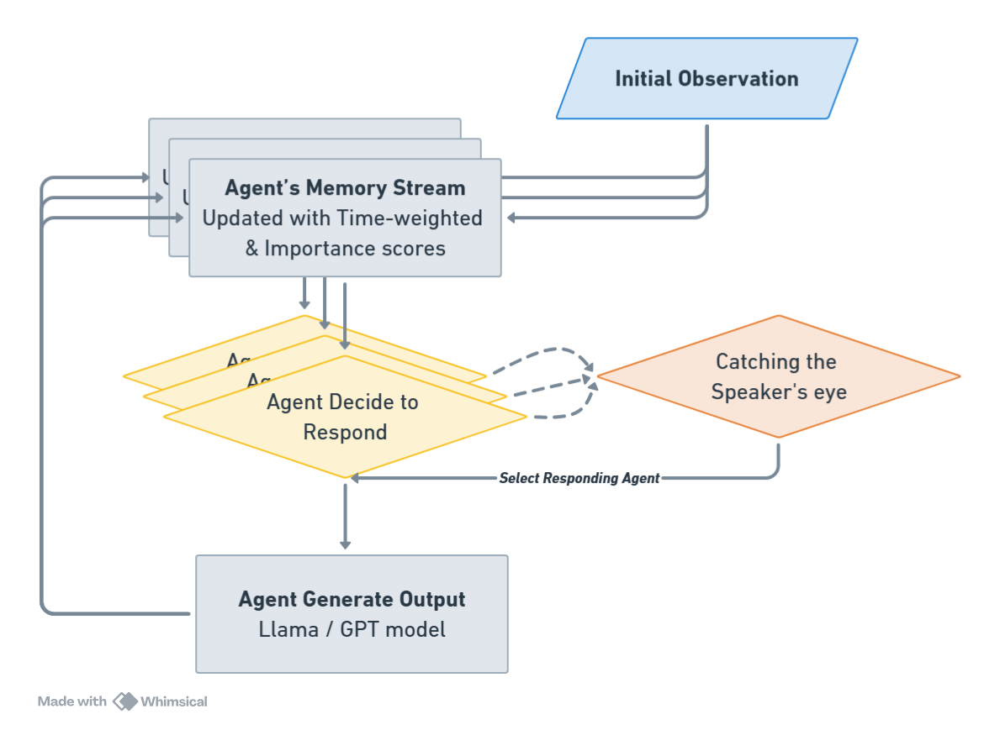

# 🏛️ MA_Thesis: Generative Agents in Parliamentary Debate  
**Simulating Rhetoric, Memory, and Cross-Party Interactions**  

📌 **Author:** Hao-Ting Chan  
📌 **Institution:** University of Mannheim  
📌 **Theis Supervisor:** Prof. Marc Ratkovic, Ph.D.  
📌 **Date:** March 2025  

## 📖 Overview  
This repository contains the code, data, and results from my Master’s thesis: **“Generative Agents in Parliamentary Debate: Simulating Rhetoric, Memory, and Cross-Party Interactions.”**  

The thesis investigates how **large language model (LLM)-based generative agents** can be used to **simulate UK parliamentary debates**. It explores the effectiveness of **fine-tuning, retrieval-augmented memory, and persona-based prompting** in achieving semantic, topical, and rhetorical fidelity to real debates. The study applies various NLP techniques to measure how well AI-generated debates reflect actual legislative discussions.

---

## 🚀 Key Features  
✅ **Multi-agent debate simulation**: Fine-tuned LLMs simulate UK House of Commons debates using persona-driven agents.  
✅ **Fine-tuned Llama model**: Trained on historical parliamentary debates to enhance rhetorical accuracy.  
✅ **Evaluation metrics**: **Topical coherence, semantic similarity, and linguistic style analysis** via **BERTopic, LIWC, LSM, and cosine similarity metrics**.  
✅ **Perturbation experiments**: Simulates real-world political crises to assess linguistic and argumentative shifts in AI-driven debates.  
✅ **Comparative analysis**: Evaluates GPT-3.5 vs. Llama-3.2 models to determine realism in simulated legislative debates.  

---

## 📊 Methodology  

1️⃣ **Data Collection**  
- Historical UK parliamentary transcripts (ParlSpeech dataset).  
- Speaker-specific fine-tuning datasets for MPs to capture rhetorical and ideological alignment.  

2️⃣ **Model Training & Inferencing**  
- **Base models**: GPT-3.5, Llama-3.2
- **Inferencing tests** on Theresa May’s real debate responses  
- **Fine-tuned models**: Llama-3.2 fine-tuned on parliamentary debates  

3️⃣ **Evaluation Metrics**  
- **Topical Coherence:** BERTopic  
- **Semantic Similarity:** BERTScore & Sentence Embeddings  
- **Stylistic Fidelity:** LIWC & LSM  
- **Perturbation Study:** Analyzing shift in LSM scores under crisis events  

---

## 📖 Notebooks  
| Notebook                                | Description                                        |
|-----------------------------------------|----------------------------------------------------|
| `Data_PreProcessing.qmd`                | Prepares raw parliamentary data.                 |
| `Inferencing_Gpt3.5.ipynb`              | Tests GPT-3.5 inferencing ability.                 |
| `Inferencing_Llama3.2_base.ipynb`       | Evaluates Llama 3.2 before fine-tuning.            |
| `Inferencing_Llama3.2_finetuned.ipynb`  | Analyzes fine-tuned Llama model.                   |
| `MiniHOC_v4.ipynb`                      | Simulates a multi-agent debate.                    |
| `Text_analysis_Debates.ipynb`           | Evaluates linguistic structure.                  |

---

## 📌 How to Use

### 1️⃣ Exploratory Data Analysis & Preprocessing  
- **Data Preparation:**  
  - `code/Data_PreProcessing.qmd` – Prepares and cleans the ParlSpeech V2 dataset, the results of the cleaned dataset can be found on my [Kaggle Dataset](https://www.kaggle.com/datasets/haotingchan/parlspeech/data?select=df_HoC_miniDebate.csv).
- **Exploratory Analysis:**  
  - `code/parlspeech_EDA.ipynb` – Conducts comprehensive exploratory data analysis on the ParlSpeech data and generates prompt-response pairs for inferencing.
- **Training Data Preparation:**  
  - `code/Preprocess_data_TheresaMay.ipynb` – Prepares training data for fine-tuning using Theresa May’s debate transcripts.
  - `code/Preprocess_data_sixMPs.ipynb` – Converts training data from six Members of Parliament into a JSON chat format for fine-tuning.

### 2️⃣ Fine-tuning Llama-3.2-Instruct Model
Navigate to the `code/finetuning` folder and run the corresponding Python notebook to replicate the fine-tuning process. Each notebook fine-tunes a Llama 3.2-Instruct model on the transcript data of a specific Member of Parliament.
(_Note: `finetune_Llama_TheresaMay.ipynb` is only used for inferencing_)

### 3️⃣ Running Inferencing
Run inferencing with `code/Inferencing_Gpt3.5.ipynb`, `code/Inferencing_Llama3.2_base.ipynb`, and `code/Inferencing_Llama3.2_finetuned.ipynb` to generate the output response of each model to parliamentary prompts.

### 4️⃣ Running the Simulation 
This repository includes four Python notebooks for running a **Mini House of Commons (MiniHoC) debate simulation** on the topic **"Free Movement of EU Nationals."** The simulation leverages the Generative Agent framework and the Debate framework illustrated below:
    

      
    

  📌 **Available Simulation Notebooks**:  
  - `code/MiniHOC_v1.ipynb` runs a MiniHoC with Gpt3.5
  - `code/MiniHOC_v2.ipynb` runs a MiniHoC with Gpt3.5 and Llama 3.2-Instruct
  - `code/MiniHOC_v3.ipynb` runs a MiniHoC with Gpt3.5 and fine-tuned Llama 3.2-Instruct models
  - `code/MiniHOC_v4.ipynb` runs the exact `MiniHOC_v3.ipynb` setup but with a perturbation event to evaluate bipartensenship

### 5️⃣ Evaluating Model Performance  
The performance of the AI-generated parliamentary debates is assessed using multiple linguistic, semantic, and rhetorical evaluation metrics to compare them with real parliamentary discourse.

- **Agent-Specific Analysis:**
  - `code/Text_analysis_Agents.ipynb` – Evaluates the rhetorical style, coherence, and linguistic fidelity of individual generative agents (MPs). This includes:
    - **Language Style Matching (LSM):** Measuring linguistic coordination between AI-generated responses and real MPs.
    - **Linguistic Inquiry and Word Count (LIWC):** Analyzing stylistic authenticity and psychological tone.
    - **Semantic Similarity Analysis:** Analyzing cosine similarity of [Sentence embeddings](https://huggingface.co/sentence-transformers/all-mpnet-base-v2).

- **Debate-Level Analysis:** 
  - `code/Text_analysis_Debates.ipynb` – Assesses the overall structure and coherence of AI-generated debates compared to real parliamentary discussions. Key metrics include:
    - **BERTopic Modeling:** Evaluating topical coherence and coverage in simulated vs. real debates.
    - **BERTScore & Sentence-Transformers Similarity:** Measuring semantic fidelity between AI-generated and real parliamentary speeches.
    - **Cross-Party Linguistic Coordination with LIWC:** Analyzing how AI-generated debates mimic adversarial or bipartisan dynamics.
    - **Perturbation Analysis with LSM:** Testing how AI agents respond to geopolitical or economic shocks in debate settings.
